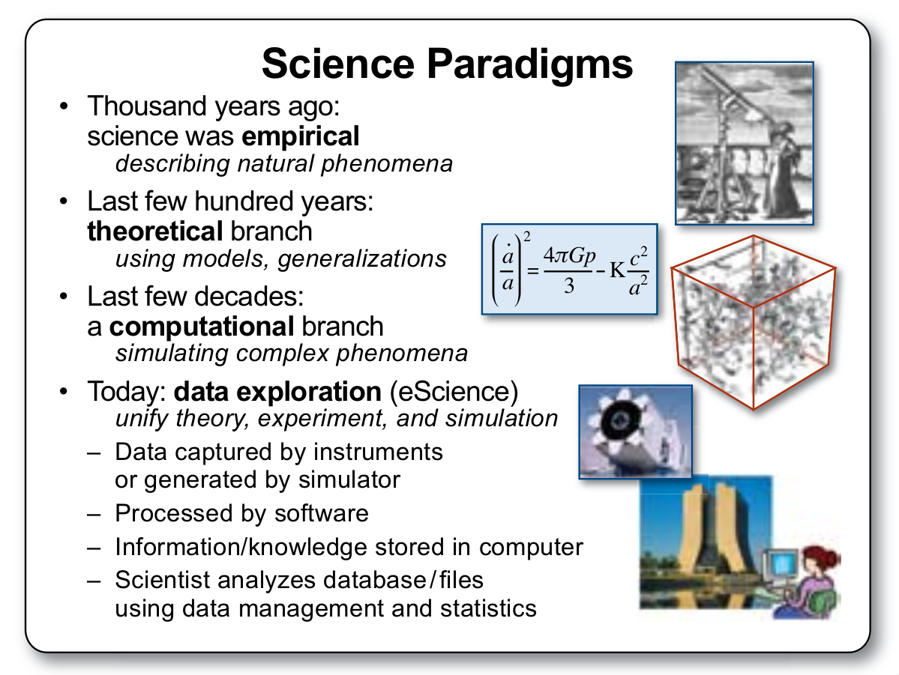

layout: true

---

# Introduction

Why should research be reproducible?

--

.pull-left[

For Science

- to have a standard that allows to judge scientific claims
- Avoiding duplication and encourage cumulative knowledge development

]

--

.pull-right[

For You

- gain better work habits
- simplify and deepen teamwork
- changes are easier
- gain higher impact (?)

]

.reference[Gandrud, C., 2014. Reproducible Research With R and RStudio, The R Series. CRC Press, Boca Raton; London; New York.]

---

# Reproducible Research

.italic["Replication is the ultimate standard by which scientific claims are judged."]

--

.italic["However, with computational science and the corresponding collection of large and complex data sets the notion of replication can be murkier."]

--

Accordingly, Researchers .italic["(...) have been calling for reproducibility, or reproducible research, as an attainable minimum standard for assessing the value of scientific claims, particularly when full independent replication of a study is not feasible."]

.center[

.reference[Peng, R.D., 2011. Reproducible Research in Computational Science. Science 334, 1226–1227. https://doi.org/10.1126/science.1213847]

]

---

# Reproducible Research

Today, most of our work is data-intensive work (or we make it as such thanks to computers). 

.pull-left[

We live in the "fourth paradigm" (Gray 2009)

.center[]

.reference[
Gray, J., 2009. A Transformed Scientific Method, in: Hey, T., Tansley, S., Tolle, K. (Eds.), The Fourth Paradigm: Data-Intensive Scientific Discovery. Microsoft Research, Redmond, Washington, pp. 17--31.
]

]

--

.pull-right[
New, pi-shaped scientists are needed (Marwick 2017) and students have to be trained to be such (Faris 2011).

.center[]

.reference[
Marwick, B., 2017. Computational Reproducibility in Archaeological Research: Basic Principles and a Case Study of Their Implementation. Journal of Archaeological Method and Theory 24, 424–450. https://doi.org/10.1007/s10816-015-9272-9

Faris, J., Kolker, Evelyne, Szalay, A., Bradlow, L., Deelman, E., Feng, W., Qiu, J., Russell, D., Stewart, E., Kolker, Eugene, 2011. Communication and Data-Intensive Science in the Beginning of the 21st Century. OMICS: A Journal of Integrative Biology 15, 213–215. https://doi.org/10.1089/omi.2011.0008

]
]

---

# Reproducible Research: Help for archaeologists

.center[Places to get you started:]
--
.pull-left[

Terms, techniques, software, relevant for archaeologists:

.center[]

.reference[Marwick, B., 2017. Computational Reproducibility in Archaeological Research: Basic Principles and a Case Study of Their Implementation. Journal of Archaeological Method and Theory 24, 424–450. https://doi.org/10.1007/s10816-015-9272-9
]

]

--

.pull-right[

A software-tool that helps you make the first steps:

.center[

https://github.com/benmarwick/rrtools
]

]

---

class: full-page-slide

# The basic terms and elements

---

# Literate Programming

.pull-left[
The Computer Journal, .bold[1983]

]

--

.pull-right[

]

---

# Markup languages

Markdown, RMarkdown, Pandoc, 

.center[]

.reference[Cooper, N., Hsing, P.-Y. (Eds.), 2017. A Guide to Reproducible Code in Ecology and Evolution. British Ecological Society.([pdf](https://www.britishecologicalsociety.org/wp-content/uploads/2017/12/guide-to-reproducible-code.pdf))]

---

# Version control

.left[]

.pull-left[
.center[]

.reference[Cooper, N., Hsing, P.-Y. (Eds.), 2017. A Guide to Reproducible Code in Ecology and Evolution. British Ecological Society.([pdf](https://www.britishecologicalsociety.org/wp-content/uploads/2017/12/guide-to-reproducible-code.pdf))]
]
--

.pull-right[
.center[]

.reference[https://git-scm.com/]
]

---

# Containerization

.center[]

or "operating-system-level virtualization" or .italic[made to last/run forever]

- create a container with all your data, software, scripts, publication text
- never run into the issue of incompatible or too old software versions

---

# Data publishing

.pull-left[
.center[]
- since 2013; developed by CERN; EU funded by project OpenAIREplus
- choose free license
]

.pull-right[
.center[]
- since 2011; for profit
- Create Common license
]

.center[
 
- open for all research
- provide DOI for each object
- connect user accounts via ORCID
- Synchronise to releases of software on Github

detailed comparison of Zenodo and Figshare [here](https://zenodo.org/record/12664)]
---

# All together

 

.center[

]

.reference[Marwick, B. (+48 other authors), 2017. Open science in archaeology. SAA Archaeological Record 17, 8–14.]

---

# Start now.

It's easy, advantageous, and sustainable. Don't wait to invest the one time effort to switch your workflow.

--

One last question: Who has access to your publications? 

--

Preprints e.g. at .bold[SocArXiv] (https://osf.io/preprints/socarxiv/) are an easy and effortless way to guarantee access to your publications for everyone. 

.center[

]

.reference[Marwick, B. (+48 other authors), 2017. Open science in archaeology. SAA Archaeological Record 17, 8–14.]

---

class: full-page-slide

# Thank you very much for your attention

 

.center[
.white[You can find the slides here: https://github.com/ISAAKiel/LAC2018_Session_44C ]

 
]

