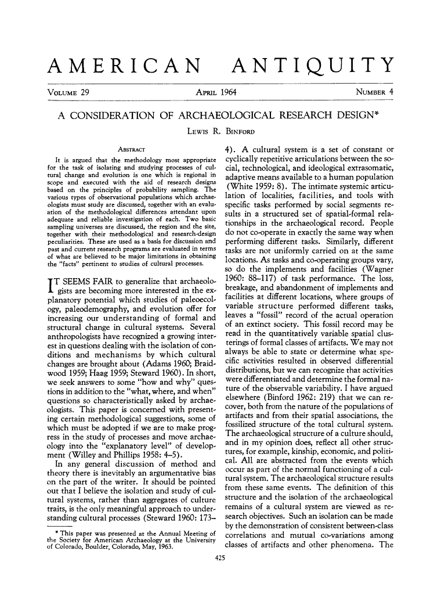
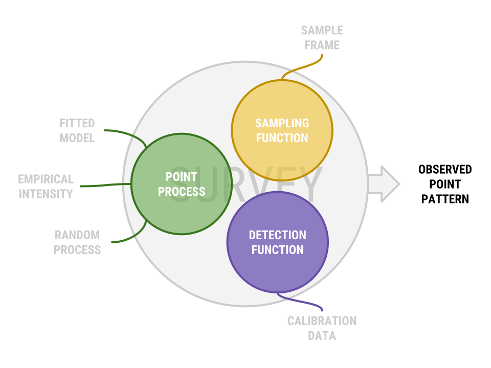
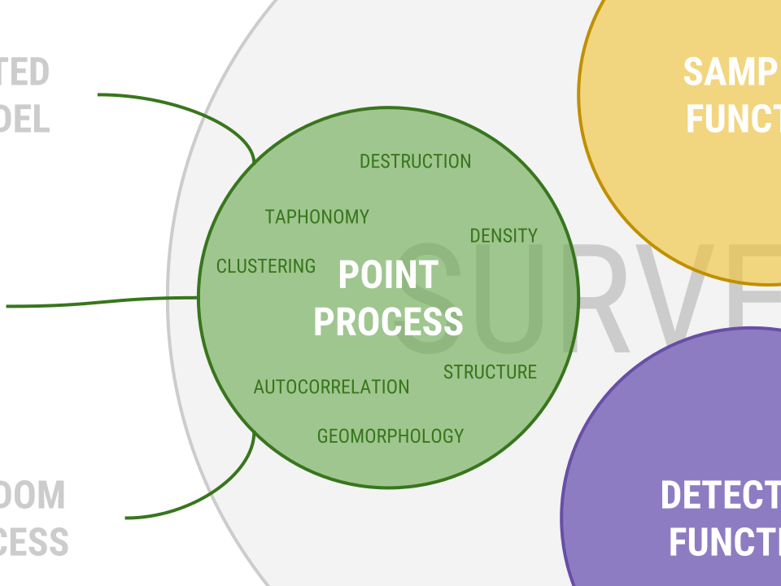
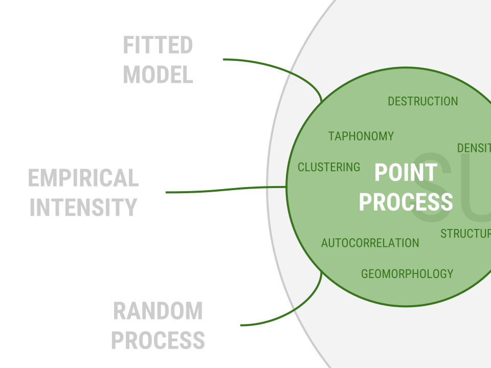
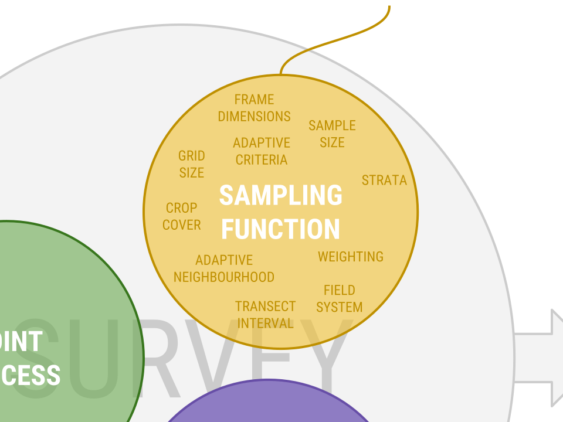
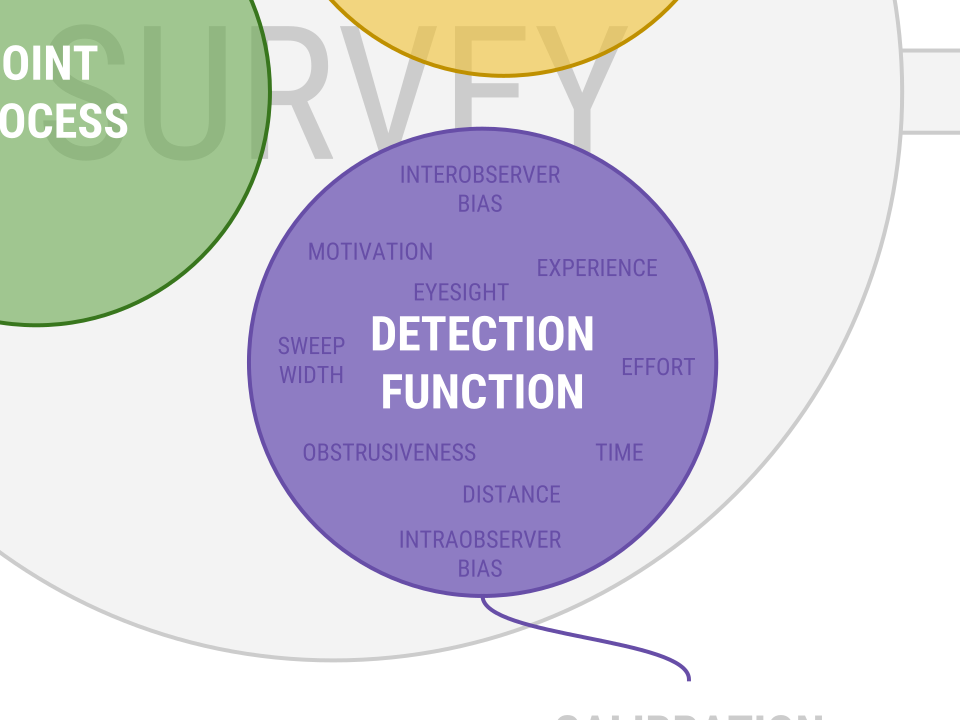

## from reproducibility to replicability

```{r eval=FALSE}
open_data %>% 
  open_software() %>% 
  open_code() %>% 
  reproducible_results
```

## from reproducibility to replicability

```{r eval=FALSE}
the_past %>% 
  preservation() %>% 
  recovery(method = c("excavation", "survey", "?")) %>% # usually destructive!
  sampling() %>% 
  logistics() %>% 
  lab_analysis() %>% 
  open_data %>% 
  open_software() %>% 
  open_code() %>% 
  reproducible_results %>% 
  interpretation
```

## spatial sampling in archaeology

 

## spatial sampling in archaeology


## `fieldwalkr`

An R package simulation framework for spatial surveys and sampling

* Exploratory planning of sampling strategies
* Analysis of theoretical patterns
* Reanalysis of survey data ("what if I'd done it this way?")

---



---



---



---


---



---


---



---


## implementation

### R

* open source and scripted = reproducible
* *very* large ecosystem (particularly for spatial analysis)

### tidyverse

* modern, functional code style
* 'tidy' data paradigm (everything is a table)
* sf > sp
* no 'tidy' spatstat :(

### shiny

* web-based GUIs
* limited feature set

## demo: installation
```{r echo=FALSE}
# secret presentation hacks
options(tidyverse.quiet = TRUE)

theme_blank <- function() {
  theme_minimal() + 
    theme(axis.text = element_blank())
}

sf_to_ppp <- function(points, frame) {
  frame %>% divide_by(1000) %>% as("Spatial") %>% as.owin() -> window
  points <- points / 1000
  p3 <- ppp(st_coordinates(points)[,1], st_coordinates(points)[,2], window = window)
  return(p3)
}

rlgcp <- function(frame, mu, var) {
  frame %>% divide_by(1000) %>% as("Spatial") %>% as.owin() -> frame_owin 
  rLGCP(mu = mu, var = var, win = frame_owin) %>% 
    st_as_sf() %>% 
    filter(label == "point") %>% 
    st_geometry() %>% 
    multiply_by(1000) %>% 
    st_set_crs(st_crs(frame)) %>% 
    return()
}

sframe <<- NA
sunits <<- NA
sites_mu <<- NA
sites_var <<- NA
ssites <<- NA
ssurvey <<- NA
```
### package on github:
```{r}
#devtools::install_github("joeroe/fieldwalkr", quiet = TRUE)
library("fieldwalkr")
```

###  friends:
```{r message=FALSE}
library("magrittr")  # pipes!
library("tidyverse") # make R more better
library("sf")        # make R a GIS
library("maptools")  # spatial glue
library("RandomFields")
library("RandomFieldsUtils")
```

### and old friends:
```{r message=FALSE}
library("spatstat")  # point pattern analysis
```

## demo: sampling frame

```{r, echo=FALSE} 
renderPlot({
  n_poly <- input$n_poly
  sframe <<- rpolygon()
  ggplot() + geom_sf(data = sframe) + theme_blank()
})
actionButton("n_poly", icon = icon("refresh"), label = "")
```

## demo: point pattern
```{r echo=FALSE}
sidebarLayout(
  sidebarPanel(
    selectInput("process", label = "Process", choices = c("LGCP")),
    sliderInput("mu", label = "μ", min = 0.5, max = 8,
                step = 0.5, value = 3),
    sliderInput("var", label = "σ²", min = 0, max = 1,
                step = 0.05, value = 0.1)
  ),
  mainPanel(
    renderPlot({
      sites_mu <<- input$mu
      sites_var <<- input$var
      ssites <<- rlgcp(sframe, sites_mu, sites_var)
      
      ggplot() + 
        geom_sf(data = sframe) +
        geom_sf(data = ssites) +
        theme_blank()
    })
  )
)
```

## demo: sample units

```{r echo=FALSE}
sidebarLayout(
  sidebarPanel(
    selectInput("units", label = "Units", choices = c("Mosaic", "Gridded",
                                                      "Transect")),
    sliderInput("n_units", label = "Number of units", min = 1, max = 500,
                step = 1, value = 50),
    selectInput("sample", label = "Sample", choices = c("Complete", "Random",
                                                        "Systematic")),
    sliderInput("n_sample", label = "Sample size", min = 1, max = 100,
                step = 1, value = 10, post = "%"),
    sliderInput("orient", label = "Orientation", min = 0, max = 360, step = 10,
                value = 0, post = "°")
  ),
  mainPanel(
    renderPlot({
      if (input$units == "Mosaic") {
        sunits <<- mosaic(sframe, density = input$n_units)
      }
      else if (input$units == "Gridded") {
        sunits <<- fieldwalkr::quadrats(sframe, n = round(sqrt(input$n_units)),
                                        orientation = input$orient)
      }
      else if (input$units == "Transect") {
        sunits <<- fieldwalkr::transects(sframe, n = input$n_units, orientation = input$orient)
      }
      
      if (input$sample == "Complete") {
        sunits$sample <<- factor(rep(TRUE, nrow(sunits)), levels = c(FALSE, TRUE))
      }
      else if (input$sample == "Random") {
        frac <- input$n_sample / 100
        sunits <<- sample_random(sunits, fraction = frac)
      }
      else if (input$sample == "Systematic") {
        frac <- input$n_sample / 100
        sunits <<- sample_systematic(sunits, n = round(nrow(sunits) / (nrow(sunits) * frac)))
      }
        
      ggplot() + 
        geom_sf(data = sunits, mapping = aes(fill = sample)) + 
        scale_fill_manual(values = c("lightgrey", "yellow"), guide = FALSE) +
        geom_sf(data = sframe, fill = NA) +
        theme_blank()
    })
  )
)
```

## demo: detection functions

```{r eval=FALSE}
# Detect points by applying a simple detection rate
#' @export
detect_simple <- function(unit, points, rate = 1) {
  detect_perfect(unit, points) %>%
    dplyr::sample_frac(rate) %>%
    return()
}

# Detect points by applying a uniform stochastic detection rate
#' @export
detect_random <- function(unit, points, min = 0, max = 1) {
  detect_simple(unit, points, rate = runif(1,min,max)) %>%
    return()
}

# Detect points by applying a (truncated) normal stochastic detection rate
#' @export
detect_normal <- function(unit, points, mean = 0.5, sd = 0.2) {
  repeat {
    rate <- rnorm(1, mean, sd)
    if(rate > 0 && rate < 1) break
  }
  detect_simple(unit, points, rate = rate) %>%
    return()
}
```

## demo: `survey()`

```{r echo=FALSE}
sidebarLayout(
  sidebarPanel(
    selectInput("dfunc", label = "Detection function", choices = "Simple"),
    sliderInput("rate", label = "Detection rate", min = 0, max = 1,
                step = 0.1, value = 1)
  ),
  mainPanel(
    renderPlot({
      ssurvey <<- survey(ssites, sunits, detection_function = detect_simple,
                        rate = input$rate)
      ggplot() + 
        geom_sf(data = sunits %>% filter(sample == TRUE)) + 
        geom_sf(data = sframe, fill = NA) +
        geom_sf(data = ssurvey) +
        theme_blank()
    })
  )
)
```

## now what?

## assessing performance

### % of sites recovered

```{r echo=FALSE}
renderPrint({
  (nrow(ssurvey) / length(ssites)) * 100
})
```

### model parameter estimation
```{r echo=FALSE}
renderPrint({
  spatstat::kppm(sf_to_ppp(st_geometry(ssurvey), sframe), clusters = "LGCP")
})
```

## iteration & parameterisation

```{r warning=FALSE}
region <- rpolygon()
mu <- 5
var <- 0.3
sites <- rlgcp(region, mu = mu, var = var)
units <- fieldwalkr::quadrats(region, 10)

samples <- map(seq(0.05, 1, by = 0.05),
               function(x) sample_random(units, fraction = x))

rmse <- map(samples, function(sample) {
  obs <- survey(sites, sample)
  model <- spatstat::kppm(sf_to_ppp(st_geometry(obs), region), clusters = "LGCP")
  sqrt(((mu-model$mu)^2+(var-model$modelpar["sigma2"])^2)/2)
}) %>% unlist()

```

## iteration & parameterisation

```{r echo=FALSE}
surveys <- as.data.frame(cbind(coverage = seq(0.05, 1, by = 0.05), rmse))
ggplot(surveys, aes(x = coverage, y = rmse)) + geom_line()
```

## `fieldwalkr`

### http://github.com/joeroe/fieldwalkr

* alpha(ish)
* documented
* to do:
    * shiny interface
    * extended point pattern modelling (replace or wrap spatstat?)
    * adaptive sampling
    * complex detection functions
    * logistical calibrations
    * vignettes & CRAN release
